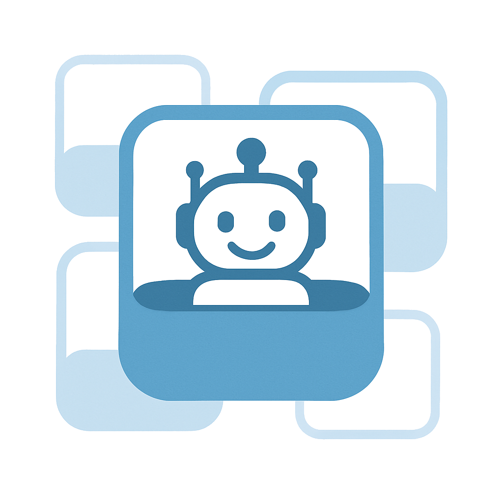

<div align="center">
  
  <h1>Capsule Agents</h1>
  <p><em>containerized agents with simple setup and native A2A interoperability</em></p>
</div>


Capsule Agents is designed to make it as easy as possible to create [Agent-to-Agent (A2A) protocol](https://github.com/google/A2A) compatible agents, with full no-code GUI support.
## Guiding Principles
1. **Full shell environments** — Agents should leverage existing CLI tools and create their own for complex tasks, using MCP judciously.
2. **Context over personas** — Rather than prompting agents to act as experts, agents should exist to manage context and communicate through the A2A protocol.
3. **Agents as Open Source Containers** – Each agent should be a self-contained, open container with its own state and tools for portability and integration.
4. **Code optional** — Agents should be creatable without programming knowledge and built to solve broader problems than just writing code.


## Features

- **A2A Native**: Designed to work seamlessly with the A2A protocol, making it easy to connect and communicate with other agents using A2A like LangGraph, n8n and many more
- **Remote MCP**: Connect any remote MCP server like Github, Tavily or your own custom server
- **Containerized**: Each agent stores state in a local SQLite database for portability
- **No Code Required**: Create agents using a simple web interface or configuration file
- **Full Shell Access**: Each agent runs in a real shell environment with the ability to execute and create reusable CLI tools
- **Interactive Workspace**: View and manage your agent’s scripts, files, and tools directly from an integrated workspace UI


## Demo   
<video src="https://github.com/user-attachments/assets/2ea61510-61be-4b25-aac3-2c7dd6ca3c89?raw=1" width="600" controls>
</video>

## Quick Start
1. Ensure [Docker](https://docs.docker.com/get-started/get-docker/) is installed on your system

2. **Set up environment variables**
   Create a `.env` file with

```env
# Add one or many (required)
OPENAI_API_KEY=your_key
ANTHROPIC_API_KEY=your_key
GOOGLE_GENERATIVE_AI_API_KEY=your_key

# Optional to restrict access to the configure page
ADMIN_PASSWORD=your_password
```

3. **Run!**
   ```bash
   docker run --env-file .env -e AGENT_URL=http://localhost:8080 -p 8080:80 -it brycewcole/capsule-agents:latest
   ```

4. **Access the agent**
   - Configuration UI: http://localhost:8080/editor
   - Agent endpoint: http://localhost:8080

## Examples

Explore the [examples directory](./examples) for pre-configured agents like a GitHub Manager and a multi-agent setup.
